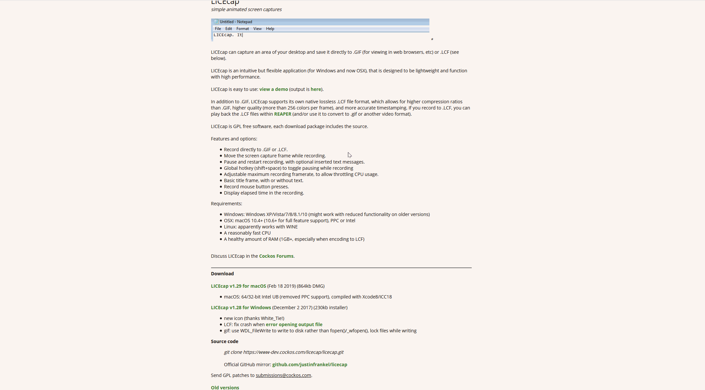
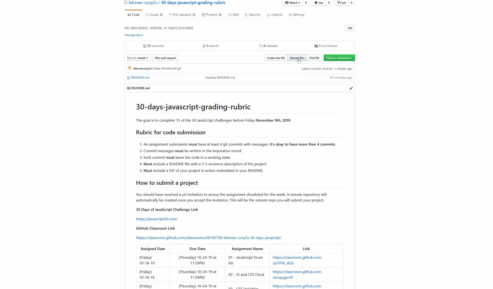

# 30-days-javascript-grading-rubric

The goal is to complete 15 of the 30 JavaScript challenges before Friday **November 8th, 2019**.

## Rubric for code submission
 1. An assignment submission **must** have at least 4 git commits with messages. **It's okay to have more than 4 commits.**
 2. Commit messages **must** be written in the imperative mood.
 3. Each commit **must** leave the code in a working state.
 4. **Must** include a README file with a 3-5 sentence description of the project.
 5. **Must** include a GIF of your project in action embedded in your README.

  
  
  ## How to submit a project
  
  You should have received a url invitation to access the assignment shceduled for the week. A remote repository will automatically be created once you accept the invitation. This will be the remote repo you will submit your project.
 
 **30 Days of JavaScript Challenge Link**
 
 https://javascript30.com/
  
**GitHub Classroom Link**

**Week1**

 Assigned Date        | Due Date         | Assignment Name  | Link
| ------------- |:-------------:| -----| --------|
| (Friday) 10-18-19  | (Thursday) 10-24-19 at 11:59PM| 01 - JavaScript Drum Kit | https://classroom.github.com/a/YFM_sIQx
| (Friday) 10-18-19  | (Thursday) 10-24-19 at 11:59PM| 02 - JS and CSS Clock | https://classroom.github.com/a/vqugxr24
| (Friday) 10-18-19  | (Thursday) 10-24-19 at 11:59PM| 03 - CSS Variables | https://classroom.github.com/a/Cayyxn9A

**Week2**
 Assigned Date        | Due Date         | Assignment Name  | Link
| (Friday) 10-25-19  | (Thursday) 10-31-19 at 11:59PM| 04 - Array Cardio Day 1 | https://classroom.github.com/a/RsZBxju4
| (Friday) 10-25-19  | (Thursday) 10-31-19 at 11:59PM| 05 - Flex Panel Gallery | https://classroom.github.com/a/1j7qdXkO
| (Friday) 10-25-19  | (Thursday) 10-31-19 at 11:59PM| 03 - 29 - Countdown Timer | https://classroom.github.com/a/kC26tms-
| (Friday) 10-25-19  | (Thursday) 10-31-19 at 11:59PM| 30 - Whack A Mole | https://classroom.github.com/a/KseUQpYS

## Git and GitHub Resources

https://www.lehmantechguide.com/git-and-github/what-is-git-and-github

## Writing Git Commits

https://chris.beams.io/posts/git-commit/

## HTML, CSS, JavaScript Resources

 Topic        | Link         |
| ------------- |:-------------:|
| HTML | https://developer.mozilla.org/en-US/docs/Web/HTML| 
| CSS | https://developer.mozilla.org/en-US/docs/Web/CSS | 
| JavaScript | https://developer.mozilla.org/en-US/docs/Web/JavaScript| 

## How to make a GIF in Windows and Mac ##

**Download LICEcap from** https://www.cockos.com/licecap/

**How to add GIF to README**

